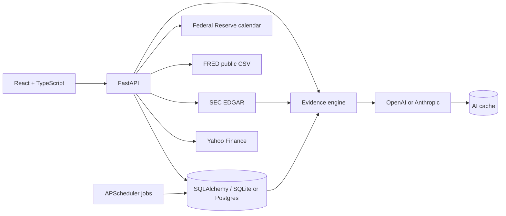

# Plain English Terminal

An S&P 500 research platform that pairs terminal-style market density with
plain-English explanations for people who do not speak finance.

The central interaction is a force-directed map of every S&P 500 constituent.
Bubble size represents market capitalization, color represents daily price
change, and alternate modes expose business relationships and historical
interest-rate sensitivity.

> Educational software, not investment advice. The interface distinguishes
> live, periodically reported, modeled, and unavailable data instead of filling
> gaps with invented values.

## Why this project exists

Most market dashboards answer “what is the number?” Plain English Terminal
also answers “what does that number mean?” It demonstrates product thinking,
financial data ingestion, interactive visualization, full-stack engineering,
and cost-conscious on-demand AI.

## What is real today

- Live Yahoo Finance prices, daily changes, market capitalizations, and history
  for all 503 current S&P 500 listings
- Market-session-aware labels such as `Live`, `Today's Close`, and
  `Friday's Close`
- Real SEC EDGAR filings for every constituent, with Risk Factors, MD&A, and
  Business sections extracted from the actual documents
- Live public FRED macro series with observation dates and source attribution
- Institutional ownership and insider transactions derived from reported
  filings via Yahoo Finance, with report dates shown in the UI
- 955 relationship edges covering every constituent: curated supply-chain and
  partnership links plus explicitly labeled industry-peer relationships
- On-demand OpenAI or Anthropic analysis with database caching; disabled
  honestly when no provider key is configured
- A [`/data`](#) page in the app listing every source and its current freshness

## The grounding rule

The interesting engineering problem in a project like this is not calling an
LLM — it is stopping the LLM from making things up. Two mechanisms do that:

**Filings are quoted, never recalled.** "Translate this 10-K" fetches the real
document from SEC EDGAR, extracts the requested section, and passes that text to
the model. The UI shows the raw text beside the translation and links to
SEC.gov, so any hallucination is visible immediately.

**Move explanations are computed first, narrated second.** Before the model is
involved, the backend decomposes a day's move into market, industry, and
company-specific components, measures it against the stock's own volatility,
and looks for SEC filings and macro releases within a few days. The model
receives that evidence and is instructed to use nothing else. With no API key
configured the endpoint still works — it returns the deterministic summary built
from the same evidence.

The practical result: when a move is statistically ordinary, the app says so
instead of inventing a narrative for noise.

## Architecture



- **Frontend:** React, TypeScript, Vite, Tailwind CSS, D3, Recharts
- **Backend:** FastAPI, Pydantic, SQLAlchemy, pandas
- **Market data:** authenticated Yahoo Finance session with throttled batches
- **Filings:** SEC EDGAR submissions API and document parsing, rate-limited to
  the SEC's fair-access policy, no key required
- **Macro data:** keyless FRED CSV feeds and the official Federal Reserve
  calendar
- **AI:** provider-agnostic OpenAI/Anthropic service, grounded in filings and
  computed evidence, cached by content fingerprint
- **Scheduling:** APScheduler refreshes quotes during market hours, fundamentals
  and history after the close, and macro series each morning
- **Quality:** pytest, Vitest, TypeScript build, oxlint, GitHub Actions

## Quick start

### Backend

```bash
cd backend
python3 -m venv .venv
source .venv/bin/activate
pip install -r requirements.txt
cp .env.example .env
uvicorn app.main:app --reload --port 8000
```

Set `SEC_USER_AGENT` in `backend/.env` to a real name and email — EDGAR rejects
requests without one. Add `OPENAI_API_KEY` to enable the AI layer; everything
except the AI narratives works without it. Keep secrets server-side; never add
them to `frontend/` or commit `.env`.

### Frontend

```bash
cd frontend
npm install
npm run dev
```

Open [http://localhost:5173](http://localhost:5173). Vite proxies `/api` → `http://127.0.0.1:8000`.

## Core product surfaces

1. S&P 500 data pipeline + company detail pages  
2. Live scrolling ticker tape with market open/closed / Friday's Close / Today's Close labels  
3. Hero D3 bubble map (industry cluster, market-cap size, color by change; relationship + rate-sensitivity modes)  
4. Site-wide plain-English metric explainers  
5. Relationship graph covering the complete universe  
6. SEC filing reader: real 10-K/10-Q/8-K documents with section extraction and
   grounded plain-English translation  
7. Move attribution: market / industry / company-specific decomposition with
   cited evidence, working with or without an AI key  
8. Live, filing-derived institutional ownership and insider activity  
9. Live FRED dashboard (inflation, labor, rates, GDP, yield curve, recession model)  
10. Sector rate-sensitivity connector to the bubble map  
11. Data & Sources page exposing every provider, record count, and staleness  

## Selected API endpoints

| Endpoint | What it returns |
| --- | --- |
| `GET /api/status` | Every data source, its state, and how stale it is |
| `GET /api/filings/{ticker}` | Recent SEC filings with plain-English form labels |
| `GET /api/filings/{ticker}/{accession}/text?section=risk_factors` | Extracted section text from the real document |
| `GET /api/ai/evidence/{ticker}` | Move attribution and evidence, no AI involved |
| `POST /api/ai/why-move/{ticker}` | The same evidence, narrated by the model |
| `POST /api/ai/filing/{ticker}` | Plain-English translation bounded to filing text |

Interactive docs are at `/docs` on the running backend.

## Verification

```bash
cd backend && PYTHONPATH=. pytest -q
cd frontend && npm run test && npm run lint && npm run build
```

CI runs those checks on every push and pull request.

## Deployment

The repository ships a Render blueprint (`render.yaml`) for the API plus
Postgres, and a Vercel config for the frontend.

**Backend (Render):** point a new Blueprint at this repo. It provisions Postgres
and the web service automatically. Then set the secrets Render cannot infer:

| Variable | Value |
| --- | --- |
| `SEC_USER_AGENT` | `Your Name (project) you@example.com` — required by the SEC |
| `CORS_ORIGINS` | Your Vercel production URL |
| `OPENAI_API_KEY` | Optional; enables AI narratives |

`DATABASE_URL` is wired from the managed database and normalized to an asyncpg
DSN at startup, so Render's `postgres://` form works as-is.

**Frontend (Vercel):** import the repo with root directory `frontend`, then set
`VITE_API_URL` to the Render service URL. `CORS_ORIGIN_REGEX` is pre-set to
allow Vercel preview deployments.

A `Dockerfile` is included if you would rather deploy the API as a container.

See [data provenance](docs/DATA_PROVENANCE.md) for source, freshness, and
limitation details.

## Disclaimer

Educational / portfolio project. Not investment advice. Historical patterns (yield curve, insider trades, rate sensitivity) are tendencies with uncertainty — never presented as guarantees.
